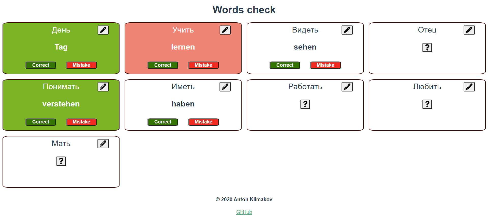

<p align="center">
    
    <a href="https://github.com/MorkovkAs/foreign-words/issues"></a>
    <a href="https://github.com/MorkovkAs/foreign-words/blob/master/LICENSE"></a>
</p>

# Jira report tool

It is an app for memorizing and checking words.

## Quick look
https://foreign-words-memorize.herokuapp.com/



## Installation

Check [Gradle](https://gradle.org/) and [Node.js with npm](https://nodejs.org/en/download/) are installed and configured

Clone the source locally:
```
$ git clone https://github.com/MorkovkAs/foreign-words/
```
Build and run project:
```
$ cd foreign-words/
$ ./gradlew build
$ ./gradlew bootRun
```
Go to [localhost](http://localhost:8080) page.

## Modules
1. `words-service` containing server side logic such as words' crud operations. [Details](words-service/README.md)
2. `words-service-ui` containing client side logic. [Details](words-service-ui/README.md)

## Thanks!
Any questions or problems give me a shout on email avklimakov@gmail.com

## License
Copyright 2020 Anton Klimakov\
Licensed under the Apache License, Version 2.0